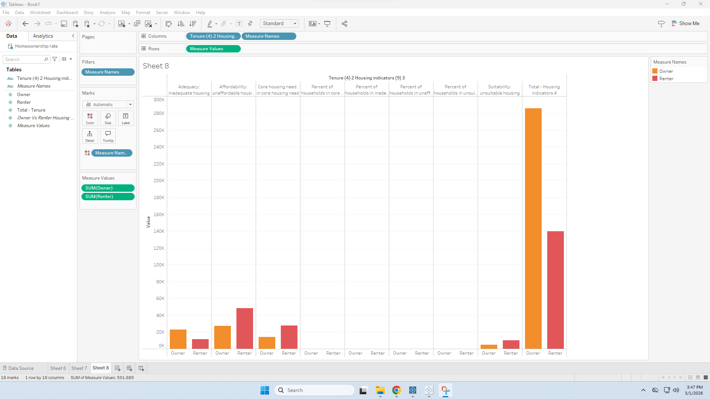
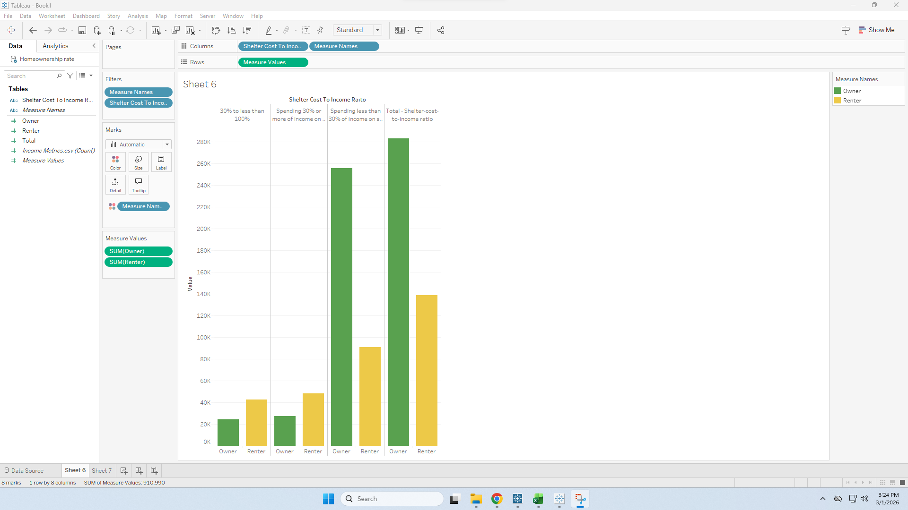
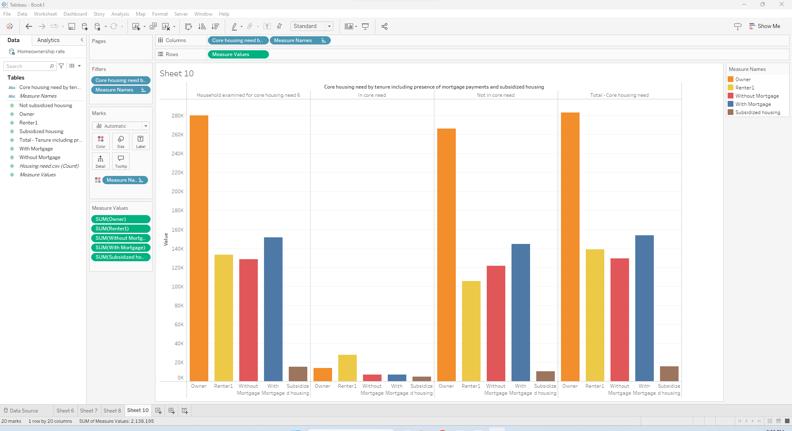

# Improving Housing Affordability in Nova Scotia: Rental Supply or First Time Homebuyer Incentives?

## Decision Statement

Should the Director of Housing Policy at the Nova Scotia Department of Municipal Affairs and Housing prioritize rental supply expansion or first time homebuyer incentives over the next 3–5 years to improve housing affordability in Nova Scotia?

## Executive Summary

Housing affordability has become a major challenge in Nova Scotia, driven by population growth, limited housing supply, and rising housing costs. Renters are facing low vacancy rates and increasing rents, while many first time homebuyers are struggling to enter the market due to high prices. These pressures have created a complex policy environment where government action plays a significant role in shaping housing outcomes.
To address affordability concerns, policymakers commonly consider two strategies, expanding rental housing supply or offering incentives to first time homebuyers. Increasing rental supply may help relieve pressure in the rental market by improving availability and stabilizing rents, but it often requires significant investment and time before results are realized. In contrast, first time homebuyer incentives can improve access to ownership in the short term, yet they may also increase demand in a constrained housing market, potentially contributing to higher prices.
This project evaluates which of these approaches would more effectively improve housing affordability in Nova Scotia over a three to five year period. By examining housing and demographic trends and considering the broader system dynamics, the analysis aims to support evidence based decision making for provincial housing policy.

## Initial Causal Loop Diagram

> [!WARNING]
> **Comment:** an HEIC image is only viewable on a mac, try openining in preview and export as PNG so windows users can view it.  Then, give it a more meaningful name, like cld.png

 

The causal loop diagram illustrates how population growth increases rental housing demand, which places upward pressure on rental prices and reduces housing affordability. A reinforcing loop shows how continued demand growth can intensify affordability challenges over time, while a balancing loop captures how higher rental prices encourage construction activity, increasing rental supply and vacancy rates, which can slow rent growth. Government housing policy influences this system by supporting construction activity and rental supply through zoning reforms and financial incentives.

## Milestone 2 Changes

## Milestone 2: Data Sources

This analysis uses publicly available Canadian housing data focused on affordability and tenure differences between renters and homeowners. The primary datasets include: (1) core housing need by tenure, (2) renter versus owner breakdowns across affordability indicators, (3) the percentage of households spending more or less than 30% of their income on shelter costs, and (4) historical homeownership rates. Together, these datasets provide insight into housing pressure, affordability challenges, and tenure dynamics. The 30% income threshold is widely used in housing policy as a benchmark for affordability stress, while core housing need captures households that experience inadequate, unsuitable, or unaffordable housing conditions. These variables directly inform the decision of whether policy should prioritize increasing rental supply or supporting first time homebuyers to improve overall housing affordability.

## Figure 4: Homeownership Rate Over Time

This time series visualization shows the historical trend in homeownership rates. The data indicate gradual increases over time followed by recent stagnation or slight decline. This pattern may reflect rising housing costs and affordability constraints limiting entry into homeownership. When housing becomes less affordable, fewer households can transition from renting to owning, increasing rental demand and further pressuring rental prices. This trend supports the reinforcing feedback loop in the Causal Loop Diagram, where affordability constraints reduce homeownership rates and intensify rental market pressure.

## Figure 3: Housing Indicators (Adequacy, Affordability, Suitability)

This chart presents broader housing indicators across tenure types, including adequacy, affordability, and suitability measures. The data reveal that affordability challenges are more pronounced among renters, while owners generally experience lower levels of housing stress across these indicators. This reinforces the structural imbalance within the housing system, where renters are more exposed to price fluctuations and supply constraints. These patterns suggest that rental market dynamics significantly influence overall housing system performance and provide evidence for the reinforcing loop linking rental prices, affordability pressure, and core housing need.

## Figure 1: Shelter Cost to Income Ratio by Tenure

This visualization compares owners and renters across shelter cost to income categories, particularly highlighting households spending more than 30% of their income on housing. The chart shows that renters are disproportionately represented in the 30%+ category, indicating significantly higher affordability pressure relative to homeowners. Since the 30% threshold is commonly used as a benchmark for housing stress, this pattern suggests that rental affordability is a primary driver of financial strain within the housing system. This finding supports the causal link between rental prices and affordability pressure, and it strengthens the argument that rental market conditions play a central role in housing stress.

## Figure 2: Core Housing Need by Tenure

This visualization illustrates differences in core housing needs between owners and renters. The data show that renters experience substantially higher levels of core housing need compared to homeowners. Core housing need captures households living in housing that is unaffordable, inadequate, or unsuitable, making it a comprehensive measure of housing stress. The elevated concentration among renters reinforces the connection between rental affordability and systemic housing vulnerability. This supports the causal relationship in the Causal Loop Diagram between affordability pressure (spending over 30% of income) and core housing need.

## Refinded CLD

## Explanation of Key Feedback Loops and Implications for the Decision

## Balancing Loop (B1): Rental Supply Stabilization Loop

The first key feedback structure in the system is a balancing loop centered on rental housing supply. When rental prices increase, affordability pressure rises, reflected in a higher percentage of households spending more than 30% of their income on housing and an increase in core housing need. As housing stress intensifies, political and public pressure for intervention grows, leading to stronger government housing policy and increased construction activity. Greater construction activity increases rental housing supply, which raises vacancy rates and reduces upward pressure on rental prices. This loop is balancing because it works to stabilize the system: rising affordability pressure eventually triggers supply expansion, which helps moderate prices.

## Implication for the decision:

This loop suggests that policies focused on expanding rental supply directly address the root cause of affordability pressure. Increasing rental construction has the potential to moderate rental prices and reduce housing stress system wide. If the objective is to relieve affordability pressure in the rental market, strengthening the supply side appears structurally effective.

## Reinforcing Loop (R1): Affordability Trap Loop

The second key structure is a reinforcing loop that can intensify housing stress. As rental prices increase, a greater share of households spend more than 30% of their income on housing, leading to higher levels of core housing need. Elevated affordability pressure reduces households’ ability to save for down payments or transition into homeownership, contributing to stagnation or decline in the homeownership rate. When fewer households transition into ownership, rental demand increases, which lowers vacancy rates and further increases rental prices. This loop reinforces itself: higher rental prices reduce access to ownership, which increases rental demand, which pushes prices even higher.

## Implication for the decision:

This reinforcing dynamic suggests that affordability pressures in the rental market can become self perpetuating. Policies that only support first time homebuyers without addressing rental supply may not sufficiently relieve pressure if rental demand remains structurally high. Conversely, policies that increase rental supply may weaken this reinforcing cycle by increasing vacancy rates and reducing rental price escalation.

## Overall System Implications

The interaction of these loops highlights a central policy trade off. Expanding rental supply directly targets the balancing loop that stabilizes affordability, while supporting first time homebuyers may indirectly reduce rental demand but does not immediately expand overall housing supply. Because the data show renters disproportionately experiencing affordability stress and core housing need, the system structure suggests that interventions on the rental supply side may produce broader affordability improvements across the housing system.

