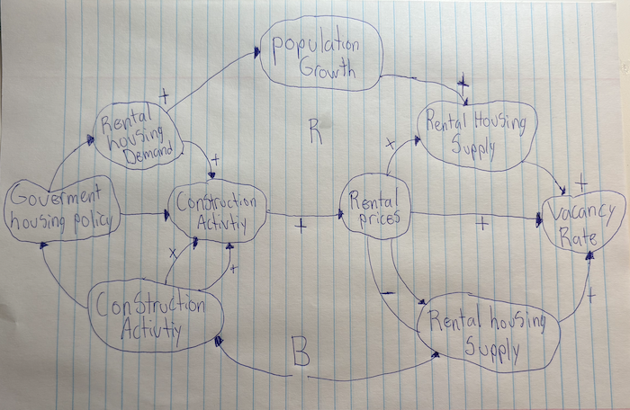

# Improving Housing Affordability in Nova Scotia: Rental Supply or First Time Homebuyer Incentives?

## Decision Statement

Should the Director of Housing Policy at the Nova Scotia Department of Municipal Affairs and Housing prioritize rental supply expansion or first time homebuyer incentives over the next 3–5 years to improve housing affordability in Nova Scotia?

## Executive Summary

Housing affordability has become a major challenge in Nova Scotia, driven by population growth, limited housing supply, and rising housing costs. Renters are facing low vacancy rates and increasing rents, while many first time homebuyers are struggling to enter the market due to high prices. These pressures have created a complex policy environment where government action plays a significant role in shaping housing outcomes.
To address affordability concerns, policymakers commonly consider two strategies, expanding rental housing supply or offering incentives to first time homebuyers. Increasing rental supply may help relieve pressure in the rental market by improving availability and stabilizing rents, but it often requires significant investment and time before results are realized. In contrast, first time homebuyer incentives can improve access to ownership in the short term, yet they may also increase demand in a constrained housing market, potentially contributing to higher prices.
This project evaluates which of these approaches would more effectively improve housing affordability in Nova Scotia over a three to five year period. By examining housing and demographic trends and considering the broader system dynamics, the analysis aims to support evidence based decision making for provincial housing policy.

## Initial Causal Loop Diagram

> [!WARNING]
> **Comment:** an HEIC image is only viewable on a mac, try openining in preview and export as PNG so windows users can view it.  Then, give it a more meaningful name, like cld.png

 

The causal loop diagram illustrates how population growth increases rental housing demand, which places upward pressure on rental prices and reduces housing affordability. A reinforcing loop shows how continued demand growth can intensify affordability challenges over time, while a balancing loop captures how higher rental prices encourage construction activity, increasing rental supply and vacancy rates, which can slow rent growth. Government housing policy influences this system by supporting construction activity and rental supply through zoning reforms and financial incentives.

## Milestone 2 Changes

