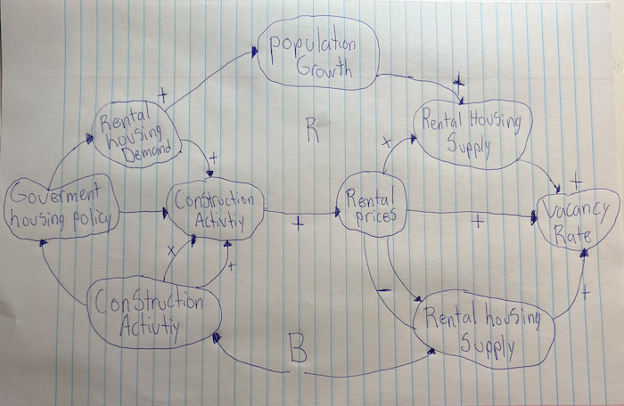

# Improving Housing Affordability in Nova Scotia: Rental Supply or First Time Homebuyer Incentives?

## Decision Statement

Should the Director of Housing Policy at the Nova Scotia Department of Municipal Affairs and Housing prioritize rental supply expansion or first time homebuyer incentives over the next 3–5 years to improve housing affordability in Nova Scotia?

## Executive Summary

Housing affordability has become a major challenge in Nova Scotia, driven by population growth, limited housing supply, and rising housing costs. Renters are facing low vacancy rates and increasing rents, while many first time homebuyers are struggling to enter the market due to high prices. These pressures have created a complex policy environment where government action plays a significant role in shaping housing outcomes.
To address affordability concerns, policymakers commonly consider two strategies, expanding rental housing supply or offering incentives to first time homebuyers. Increasing rental supply may help relieve pressure in the rental market by improving availability and stabilizing rents, but it often requires significant investment and time before results are realized. In contrast, first time homebuyer incentives can improve access to ownership in the short term, yet they may also increase demand in a constrained housing market, potentially contributing to higher prices.
This project evaluates which of these approaches would more effectively improve housing affordability in Nova Scotia over a three to five year period. By examining housing and demographic trends and considering the broader system dynamics, the analysis aims to support evidence based decision making for provincial housing policy.

## Initial Causal Loop Diagram

> [!WARNING]
> **Comment:** an HEIC image is only viewable on a mac, try openining in preview and export as PNG so windows users can view it.  Then, give it a more meaningful name, like cld.png

 

The causal loop diagram illustrates how population growth increases rental housing demand, which places upward pressure on rental prices and reduces housing affordability. A reinforcing loop shows how continued demand growth can intensify affordability challenges over time, while a balancing loop captures how higher rental prices encourage construction activity, increasing rental supply and vacancy rates, which can slow rent growth. Government housing policy influences this system by supporting construction activity and rental supply through zoning reforms and financial incentives.

## Milestone 2

## Milestone 2: Data Sources Summary

This analysis uses publicly available Canadian housing data focused on affordability and tenure differences between renters and homeowners. The primary datasets include: (1) core housing need by tenure, (2) renter versus owner breakdowns across affordability indicators, (3) the percentage of households spending more or less than 30% of their income on shelter costs, and (4) historical homeownership rates. Together, these datasets provide insight into housing pressure, affordability challenges, and tenure dynamics. The 30% income threshold is widely used in housing policy as a benchmark for affordability stress, while core housing need captures households that experience inadequate, unsuitable, or unaffordable housing conditions. These variables directly inform the decision of whether policy should prioritize increasing rental supply or supporting first time homebuyers to improve overall housing affordability.

## Milestone 2 Data Sources

Statistics Canada. (n.d.). Housing indicators by tenure including presence of mortgage payments and subsidized housing, household type including census family structure and period of construction: Canada, provinces and territories, census metropolitan areas and census agglomerations (Table 98-10-0241-01). https://www150.statcan.gc.ca/t1/tbl1/en/tv.action?pid=9810024101](https://www150.statcan.gc.ca/t1/tbl1/en/tv.action?pid=9810024101)

Statistics Canada. (n.d.). Core housing needed by tenure including presence of mortgage payments and subsidized housing: Canada, provinces and territories, census divisions and census subdivisions (Table 98-10-0247-01). https://www150.statcan.gc.ca/t1/tbl1/en/tv.action?pid=9810024701](https://www150.statcan.gc.ca/t1/tbl1/en/tv.action?pid=9810024701)

Statistics Canada. (n.d.). Housing indicators by tenure: Canada, provinces and territories, census divisions and census subdivisions (Table 98-10-0259-01). https://www150.statcan.gc.ca/t1/tbl1/en/tv.action?pid=9810025901](https://www150.statcan.gc.ca/t1/tbl1/en/tv.action?pid=9810025901)

Source(s): Census of Population, 1971 to 2021 (3901), and National Household Survey, 2011 (5178).

I Lost the source for data set Owners and rental totals1, i had edited it out of the file through excel and now im unable to find it, i did use statistics canada for all my data though.

## Figure 1: Homeownership Rate Over Time

This time series visualization shows the historical trend in homeownership rates. The data indicate gradual increases over time followed by recent stagnation or slight decline. This pattern may reflect rising housing costs and affordability constraints limiting entry into homeownership. When housing becomes less affordable, fewer households can transition from renting to owning, increasing rental demand and further pressuring rental prices. This trend supports the reinforcing feedback loop in the Causal Loop Diagram, where affordability constraints reduce homeownership rates and intensify rental market pressure.

## Figure 2: Housing Indicators (Adequacy, Affordability, Suitability)

This chart presents broader housing indicators across tenure types, including adequacy, affordability, and suitability measures. The data reveal that affordability challenges are more pronounced among renters, while owners generally experience lower levels of housing stress across these indicators. This reinforces the structural imbalance within the housing system, where renters are more exposed to price fluctuations and supply constraints. These patterns suggest that rental market dynamics significantly influence overall housing system performance and provide evidence for the reinforcing loop linking rental prices, affordability pressure, and core housing need.

## Figure 3: Shelter Cost to Income Ratio by Tenure

This visualization compares owners and renters across shelter cost to income categories, particularly highlighting households spending more than 30% of their income on housing. The chart shows that renters are disproportionately represented in the 30%+ category, indicating significantly higher affordability pressure relative to homeowners. Since the 30% threshold is commonly used as a benchmark for housing stress, this pattern suggests that rental affordability is a primary driver of financial strain within the housing system. This finding supports the causal link between rental prices and affordability pressure, and it strengthens the argument that rental market conditions play a central role in housing stress.

## Figure 4: Core Housing Need by Tenure

This visualization illustrates differences in core housing needs between owners and renters. The data show that renters experience substantially higher levels of core housing need compared to homeowners. Core housing need captures households living in housing that is unaffordable, inadequate, or unsuitable, making it a comprehensive measure of housing stress. The elevated concentration among renters reinforces the connection between rental affordability and systemic housing vulnerability. This supports the causal relationship in the Causal Loop Diagram between affordability pressure (spending over 30% of income) and core housing need.

## Refinded CLD

## Explanation of Key Feedback Loops and Implications for the Decision

## Balancing Loop (B1): Rental Supply Stabilization Loop

The first key feedback structure in the system is a balancing loop centered on rental housing supply (Figure 6). As rental prices increase, affordability pressure rises, reflected in a higher percentage of households spending more than 30% of their income on housing and an increase in core housing need. As housing stress intensifies, pressure for policy intervention grows, leading to stronger government housing policy and increased rental construction activity. Increased construction activity expands rental housing supply, which raises vacancy rates and places downward pressure on rental prices. This loop is balancing because it works to stabilize the system: rising affordability pressure ultimately triggers supply expansion, which helps reduce rental prices and alleviate housing stress.

## Implication for the decision:

This loop suggests that policies focused on expanding rental supply directly address the root cause of affordability pressure. By increasing construction and overall housing availability, policymakers can influence vacancy rates and reduce rental prices, improving affordability across the system. This supports prioritizing rental supply expansion as a structurally effective intervention.

## Reinforcing Loop (R1): Affordability pressure Loop

The second key structure is a reinforcing loop that intensifies housing affordability challenges (Figure 6). As rental prices increase, a greater share of households spend more than 30% of their income on housing, leading to higher levels of core housing need. Increased housing need contributes to greater rental demand, which places additional upward pressure on rental prices. This loop reinforces itself, as higher rental prices lead to greater affordability pressure and demand, which further increases prices over time.

## Implication for the decision:

This reinforcing dynamic suggests that affordability pressures in the rental market can become self-perpetuating. Policies that only support first-time homebuyers may not sufficiently reduce rental demand or affordability stress if underlying supply constraints remain. In contrast, policies that increase rental supply can weaken this reinforcing cycle by increasing vacancy rates and reducing rental price growth.

## Overall System Implications

The interaction of these feedback loops highlights a key policy trade-off. Expanding rental supply directly targets the balancing loop (B1), which stabilizes the system by reducing prices and affordability pressure. At the same time, it weakens the reinforcing loop (R1) by reducing the intensity of rental demand and price escalation. In contrast, first-time homebuyer incentives primarily act on the demand side and may not address underlying supply constraints. Based on the system dynamics and supporting data, interventions that increase rental housing supply are more likely to produce broad and sustained improvements in housing affordability in Nova Scotia.

## System Archetype Identification

The housing affordability system in Nova Scotia reflects the Limits to Growth archetype, where increasing demand creates pressure that is eventually constrained by limited system capacity. In this context, growth is driven by rising rental demand and increasing core housing need, as more households are unable to access homeownership and remain in the rental market. This demand places upward pressure on rental prices, which further increases affordability stress, measured by the proportion of households spending more than 30% of their income on housing. This dynamic is captured in the reinforcing loop (R1), where higher prices and affordability pressure continue to drive demand within the rental system. However, this growth is constrained by limited rental housing supply, which acts as the system’s key bottleneck. The balancing loop (B1) represents the response to this constraint, where higher prices incentivize construction and increase rental supply, eventually improving vacancy rates and stabilizing prices. Despite this, delays in construction and limited investment reduce the effectiveness of this balancing response. Evidence from the data supports this pattern, as rental prices have consistently increased while vacancy rates remain low, and a significant share of households exceed the 30% affordability threshold. Together, these dynamics demonstrate a system where growth is persistently constrained by supply limitations, confirming the presence of the Limits to Growth archetype.

## Status Quo Scenario (No Policy Change)

If no significant policy changes are implemented, the housing system in Nova Scotia is expected to continue its current trajectory over the next 5–10 years, with the reinforcing loop (R1) remaining dominant. Increasing rental demand, driven by population growth and limited access to homeownership, will continue to push rental prices upward. As prices rise, a growing proportion of households will exceed the 30% income threshold for housing, increasing core housing needs and further reinforcing demand within the rental market. Although the balancing loop (B1), which represents rental supply expansion, will still be present, its effects will remain limited due to delays in construction and insufficient scale of new developments. Vacancy rates are likely to remain low, potentially around 1–2%, sustaining upward pressure on prices and limiting affordability improvements. Over time, this dynamic will result in worsening affordability conditions, with more households experiencing financial strain. A key uncertainty in this scenario is the rate of population growth, which could intensify demand pressures if it accelerates. Additionally, unintended consequences may include increased housing insecurity and greater reliance on government support systems. Overall, without intervention, the system remains constrained by supply limitations, allowing reinforcing pressures to dominate and drive continued affordability challenges.

## Intervention A: Rental Supply Expansion

If policymakers prioritize rental supply expansion, the system begins to shift over the next 5–10 years as the balancing loop (B1) becomes more influential. Increased investment in rental construction and supportive policies will gradually expand housing supply, leading to higher vacancy rates and reduced pressure on rental prices. As vacancy rates increase from approximately 1–2% toward more balanced levels of 3–5%, competition among landlords will help stabilize or slow rental price growth. This shift weakens the reinforcing loop (R1), as slower price increases reduce affordability pressure and limit the growth of core housing need. Over time, this can lead to a more balanced system where supply better aligns with demand, improving overall housing affordability. However, this scenario is subject to several uncertainties. The most significant challenge is the time delay between policy implementation and the completion of new housing units, meaning benefits may not be realized immediately. Additionally, construction constraints such as labor shortages, rising material costs, and regulatory barriers may limit the pace of supply expansion. Potential unintended consequences include overbuilding in certain segments of the market or uneven distribution of new housing. Despite these risks, this intervention addresses the system’s core constraint and offers the most sustainable long-term improvement.

## Intervention B: First-Time Homebuyer Incentives

If policymakers focus on first-time homebuyer incentives, the system evolves differently over the next 5–10 years, with the reinforcing loop (R1) remaining largely intact. While these incentives may help some households transition into homeownership, they primarily act on the demand side of the housing market without addressing the underlying supply constraint. As more individuals are enabled to enter the housing market, demand for homes increases, which can drive up housing prices. This can indirectly impact the rental market by maintaining high rental demand, as many households remain priced out of ownership. As a result, rental prices may continue to rise, and the proportion of households spending more than 30% of their income on housing may remain elevated or increase. The balancing loop (B1) is minimally affected in this scenario, as rental supply does not significantly increase. A key uncertainty is the extent to which these incentives translate into meaningful increases in homeownership rates. Unintended consequences may include further price inflation in both ownership and rental markets, as increased demand is not matched by supply. Overall, this intervention may provide short-term relief for some households but does not resolve the structural issues driving affordability challenges.

## Leverage Point Analysis

The most effective leverage point in this system is increasing rental housing supply capacity, particularly through policies that accelerate construction and reduce development barriers. This point offers high impact because it targets the system’s core constraints being limited supply, rather than addressing symptoms like demand. By expanding supply, the system becomes more capable of absorbing growing demand without significantly increasing prices. This intervention directly affects both key feedback loops. Increasing supply strengthens the balancing loop (B1), as higher vacancy rates help stabilize or reduce rental prices. At the same time, it weakens the reinforcing loop (R1) by reducing affordability pressure and slowing the growth of core housing needs. Because this leverage point changes the structure of the system, it creates more sustainable long-term outcomes compared to demand-side policies. However, there are risks and potential resistance. Time delays between policy implementation and completed housing may limit short-term impact. Additionally, zoning restrictions, political opposition, and rising construction costs may slow development. Despite these challenges, targeting rental supply remains the most effective intervention, as it addresses the root cause of housing affordability issues and improves system balance over time.

## Connection to Decision-Maker

The analysis suggests that the most effective decision for policymakers in Nova Scotia is to prioritize rental supply expansion over demand-side interventions. The scenario analysis shows that maintaining the status quo allows the reinforcing loop (R1) to continue driving affordability challenges, while demand-focused policies such as first-time homebuyer incentives fail to address the system’s underlying constraint. In contrast, increasing rental supply strengthens the balancing loop (B1), improves vacancy rates, and stabilizes rental prices over time. Although this approach involves delays and implementation challenges, it directly targets the root cause of the affordability crisis. As a result, the decision-maker should focus on policies that accelerate rental construction and reduce development barriers, as this offers the most sustainable and system-wide improvement in housing affordability.

